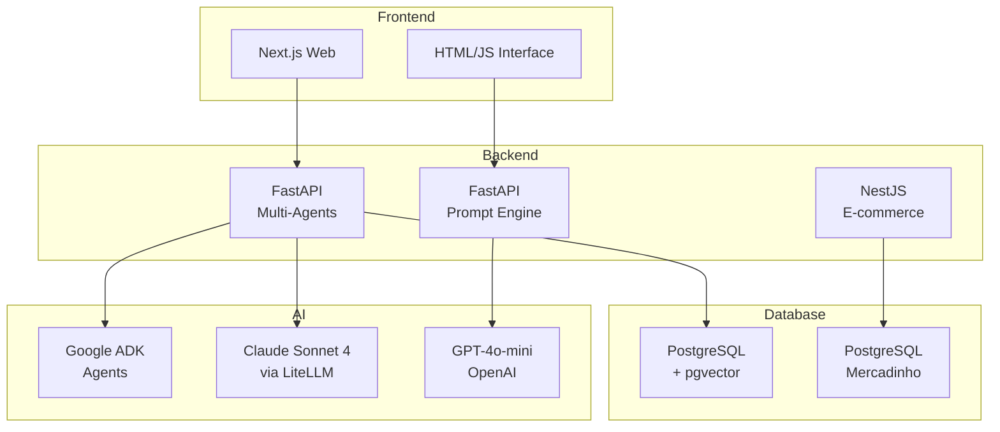

# FullCycle IA Agents

Repositório com projetos demonstrativos desenvolvidos durante a **TechWeek de IA #9** da [Full Cycle](https://fullcycle.com.br). Os projetos exploram desenvolvimento assistido por IA: Multi-Agent RAG jurídico, Prompt Engineering e API e-commerce com NestJS.

## 🌐🇧🇷 [Versão em Português](README.md)
## 🌐🇺🇸 [English Version](README_EN.md)

## 📖 [Architecture](ARCHITECTURE.md)

---

## 📅 Sobre o Evento

**Full Cycle Tech Week: IA for Developers** é um evento online e 100% gratuito realizado de **24 a 26 de novembro de 2026**. O evento foi realizado em conjunto com a **Faculdade Full Cycle de Tecnologia** e tinha como objetivo ensinar como aplicar IA de verdade nas aplicações dos participantes.

### O que você aprendeu

- **Metodologias e workflows** para turbinar produtividade
- **Desenvolvimento de Agentes autônomos** que tomam decisões e executam processos complexos
- **Recursos avançados no Cursor** para desenvolvimento assistido
- **Criação e consumo de servidores MCPs** (Model Context Protocol)
- **Google ADK (Agent Development Kit)** para criar agentes de IA
- **Docker MCP Toolkit** para integração

### Instrutor

**Wesley Willians** - Fundador/CEO da Full Cycle

- Graduação em Tecnologia e Mídias Digitais pela PUC-SP
- MBA Executivo em Gestão de Negócios pelo Ibmec
- Duas especializações pelo MIT
- Premiado como um dos 100 líderes em educação pelo "Fórum Global de Educação e Aprendizado"
- Microsoft MVP, Google Developer Expert, Docker Captain

### Certificado

Ao final do evento, os participantes receberam um certificado de curso livre com carga horária de **8 horas** da Faculdade Full Cycle de Tecnologia.

---

## 📚 Materiais do Evento

- [📺 Aulas e Links](Tech%20Week%20IA%20for%20Devs/README.md)
- [📊 Comparação de Frameworks](COMPARISON.md)

---

## 📁 Projetos Incluídos

Este repositório contém 3 projetos independentes:

### 1. 🔍 Multi-Agents RAG (techweekia9-multi-agents-rag-main)

Sistema multi-agentes para análise de processos jurídicos utilizando **RAG (Retrieval-Augmented Generation)** com busca semântica vetorial.

**Tech Stack:**
- Backend: Python 3.12, FastAPI, Google ADK, LiteLLM
- Frontend: Next.js 14, React 18, TailwindCSS
- Banco de Dados: PostgreSQL 16 + pgvector
- LLM: Claude Sonnet 4 (Anthropic) via LiteLLM

**Funcionalidades:**
- Agentes especializados (Pesquisa, Jurisprudência, Análise)
- Busca semântica com embeddings Gemini
- Chat interativo com contexto jurídico

### 2. 📝 Prompt Engineering (techweekia9-prompt-main)

Aplicação web interativa que demonstra diferentes **técnicas de prompt engineering** comparando resultados com o mesmo modelo.

**Tech Stack:**
- Backend: Python, FastAPI
- Frontend: HTML/CSS/JS
- LLM: GPT-4o-mini (OpenAI)

**Técnicas demonstradas:**
- Zero-shot prompting
- Chain of Thought (CoT)
- Tree of Thoughts (ToT)
- ReAct (Reasoning + Action)

### 3. 🛒 FullCycle Mercadinho (techweekia9-dev-com-ia-main)

API de e-commerce B2C construída com **NestJS** demonstrando desenvolvimento assistido por agentes de IA.

**Tech Stack:**
- Framework: NestJS 11, TypeScript
- Banco de Dados: PostgreSQL 16, TypeORM
- Infraestrutura: Docker
- Pagamentos: Stripe

**Funcionalidades:**
- Catálogo de produtos
- Autenticação JWT
- Carrinho de compras
- Notificações por email

---

## 📊 Arquitetura Geral



---

## 🛠️ Pré-requisitos

- [Docker](https://docs.docker.com/get-docker/) e Docker Compose
- Python 3.10+ (para projetos Python)
- Node.js 18+ (para projeto NestJS)
- Chaves de API:
  - Anthropic (Claude)
  - Google AI (Gemini)
  - OpenAI

---

## 🚀 Como Executar Cada Projeto

### Multi-Agents RAG

```bash
cd techweekia9-multi-agents-rag-main
cp services/agents/.env.example services/agents/.env
# Configure as chaves de API no .env
docker compose up

# Em outro terminal, ingira os dados:
docker compose exec agents bash
python -m ingestion.ingest
```

Acesse: http://localhost:3000

### Prompt Engineering

```bash
cd techweekia9-prompt-main
python -m venv venv
source venv/bin/activate  # ou venv\Scripts\activate no Windows
pip install -r requirements.txt
echo "OPENAI_API_KEY=sk-..." > .env
uvicorn main:app --reload
```

Acesse: http://localhost:8000

### FullCycle Mercadinho

```bash
cd techweekia9-dev-com-ia-main
docker compose up -d
docker compose exec nestjs-api npm install
docker compose exec nestjs-api npm run start:dev
```

Acesse: http://localhost:3000

---

## 📚 Estrutura do Repositório

```
Fullcycle-Ia-Agents/
├── techweekia9-multi-agents-rag-main/
│   ├── services/
│   │   ├── agents/          # Backend Python (FastAPI + Google ADK)
│   │   └── web/             # Frontend Next.js
│   ├── db/                  # Schema PostgreSQL + pgvector
│   ├── docker-compose.yml
│   └── README.md
│
├── techweekia9-prompt-main/
│   ├── routes/              # Endpoints FastAPI
│   ├── prompts.py           # Prompts por técnica
│   ├── techniques.py        # Engines de raciocínio
│   ├── main.py              # Servidor
│   └── frontend.html        # Interface
│
├── techweekia9-dev-com-ia-main/
│   ├── src/                 # Código NestJS
│   ├── test/                # Testes E2E
│   ├── docs/                # Documentação (PRD)
│   ├── CLAUDE.md            # Guidelines para agentes
│   └── compose.yaml
│
└── README.md               # Este arquivo
```

---

## 🌐 Deploy

### Multi-Agents RAG
Deploy recomendado usando Docker Compose em servidor Linux. Para produção, considere:
- Substituir dados mock por base real
- Configurar autenticação na API
- Usar serviço gerenciado de PostgreSQL

### Prompt Engineering
Pode ser deployado em qualquer plataforma que suporte Python:
- Render, Railway, Fly.io
- AWS Lambda + API Gateway

### FullCycle Mercadinho
Deploy em container ou plataforma PaaS:
- AWS ECS/Fargate
- Google Cloud Run
- Azure Container Apps

---

## 📝 Licença

Este projeto é parte do material educacional da [Full Cycle](https://fullcycle.com.br).

---

**Última atualização:** 30/03/2026
**Versão:** 1.0.0
**Manutenedor:** Felipe Moreira
