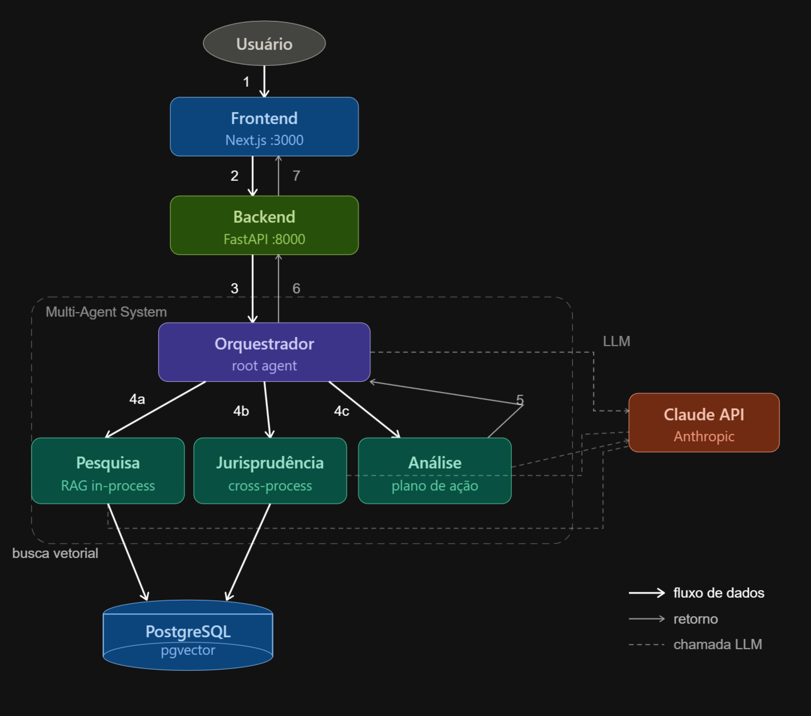
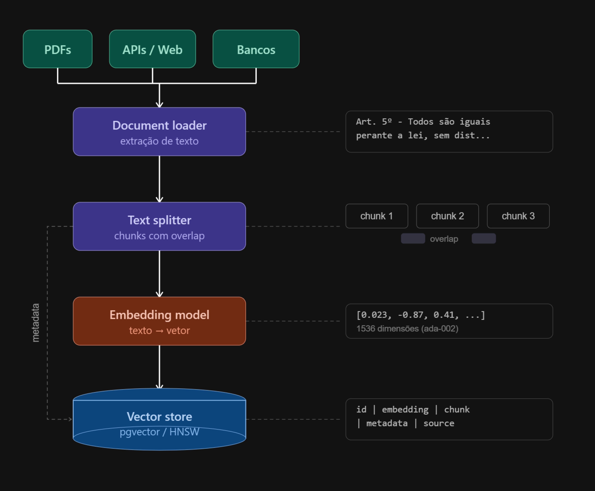
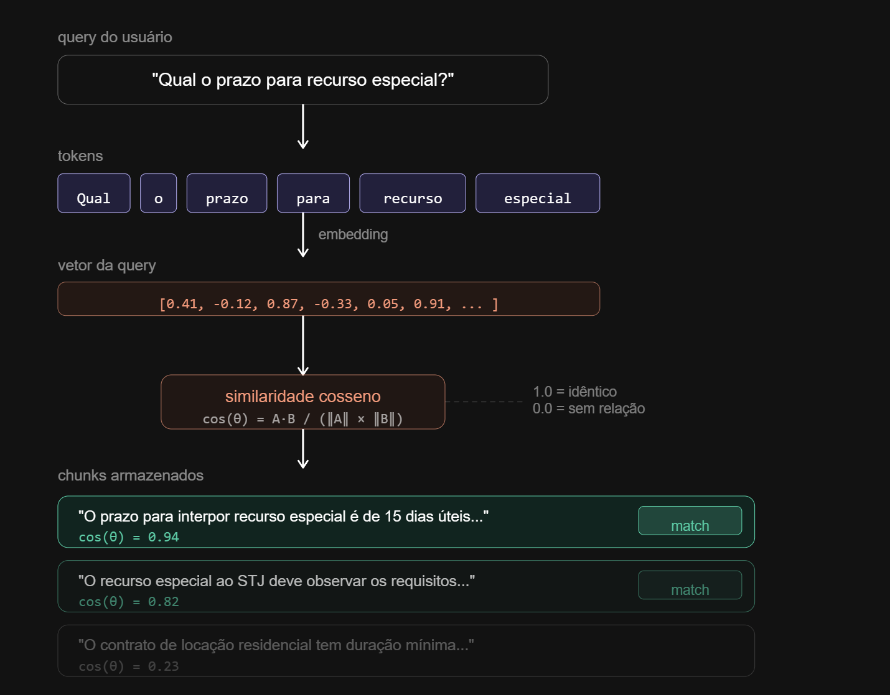

# Agentes Jurídicos — Análise de Processos com Multi-Agentes e RAG

Sistema multi-agentes para análise de processos jurídicos utilizando **RAG (Retrieval-Augmented Generation)** com busca semântica vetorial. Desenvolvido durante a **TechWeek de IA #9** da [Full Cycle](https://fullcycle.com.br).

O sistema permite selecionar um processo jurídico e interagir com agentes especializados que pesquisam dentro do processo, buscam jurisprudência em casos similares e geram planos de ação estratégicos — tudo fundamentado nos documentos reais da base de dados.

## Arquitetura



O sistema é composto por 3 serviços Docker orquestrados via Docker Compose:

| Serviço | Tecnologia | Porta | Descrição |
|---------|-----------|-------|-----------|
| **Frontend** | Next.js 14 / React 18 | `:3000` | Interface de chat para interação com os agentes |
| **Backend** | FastAPI / Python 3.12 | `:8000` | API que executa o sistema multi-agentes via Google ADK |
| **Banco de Dados** | PostgreSQL 16 + pgvector | `:5432` | Armazena processos e embeddings vetoriais |

### Sistema Multi-Agentes

O sistema utiliza o [Google ADK (Agent Development Kit)](https://google.github.io/adk-docs/) com **LiteLLM** para comunicação com a API da Anthropic (Claude). Os agentes são organizados hierarquicamente:

**Orquestrador (`orquestrador_juridico`)** — Agente raiz que coordena todo o sistema. Recebe as mensagens do usuário, lista e seleciona processos, e delega tarefas para os agentes especializados conforme a necessidade.

**Agente Pesquisa (`agente_pesquisa`)** — Pesquisador jurídico especializado que busca informações **dentro do processo atual** selecionado. Utiliza busca semântica (RAG) para encontrar trechos relevantes nos documentos do processo, citando seção e página.

**Agente Jurisprudência (`agente_jurisprudencia`)** — Especialista em jurisprudência que busca casos **similares em outros processos** da base de dados. Identifica precedentes, decisões semelhantes e pontos de referência relevantes.

**Agente Análise (`agente_analise`)** — Analista jurídico sênior que gera um **plano de ação estratégico** com base nos resultados da pesquisa e da jurisprudência. Produz: resumo da situação, análise da sentença (pontos fortes/fracos), próximos passos e fundamentação em precedentes.

Para uma análise completa, o orquestrador encadeia os três agentes em sequência: **Pesquisa → Jurisprudência → Análise**.

## RAG (Retrieval-Augmented Generation)



O RAG é o mecanismo que permite aos agentes responder com base em **dados reais dos processos**, em vez de depender apenas do conhecimento geral do LLM.

### Pipeline de Ingestão

1. **Dados de entrada** — Documentos jurídicos (petição inicial, contestação, depoimentos, sentença)
2. **Chunking** — Os documentos são divididos em trechos (chunks) com metadados (seção, página)
3. **Embedding** — Cada chunk é convertido em um vetor de 768 dimensões usando o modelo **Google Gemini Embedding 001**
4. **Armazenamento** — Os vetores são armazenados no PostgreSQL com a extensão **pgvector**, usando índice **HNSW** para busca eficiente

## Busca Semântica



Quando o usuário faz uma pergunta, o sistema:

1. Converte a pergunta em um vetor (embedding) usando o mesmo modelo Gemini
2. Calcula a **similaridade cosseno** entre o vetor da pergunta e todos os chunks armazenados
3. Retorna os trechos mais relevantes (maior similaridade) como contexto para o agente LLM

A similaridade cosseno varia de `0.0` (sem relação) a `1.0` (idêntico), permitindo encontrar trechos semanticamente relevantes mesmo quando as palavras exatas não coincidem.

## Tech Stack

- **Backend**: Python 3.12, [Google ADK](https://google.github.io/adk-docs/) v1.27.0, LiteLLM, FastAPI, psycopg2
- **Frontend**: Next.js 14, React 18, TailwindCSS, react-markdown
- **Banco de Dados**: PostgreSQL 16 + [pgvector](https://github.com/pgvector/pgvector)
- **LLM**: Claude Sonnet 4 (Anthropic) via LiteLLM
- **Embeddings**: Google Gemini Embedding 001 (768 dimensões)
- **Infraestrutura**: Docker Compose

## Pré-requisitos

- [Docker](https://docs.docker.com/get-docker/) e Docker Compose
- Chave de API da **Anthropic** (para o Claude) — [obter aqui](https://console.anthropic.com/)
- Chave de API do **Google AI** (para embeddings Gemini) — [obter aqui](https://aistudio.google.com/apikey)

## Como Rodar

**1. Clone o repositório:**

```bash
git clone <url-do-repositorio>
cd agents-rag-test
```

**2. Configure as variáveis de ambiente:**

```bash
cp services/agents/.env.example services/agents/.env
```

Edite o arquivo `services/agents/.env` e preencha suas chaves de API:

```env
ANTHROPIC_API_KEY=sk-ant-...
GOOGLE_API_KEY=AIza...
```

**3. Suba os containers:**

```bash
docker compose up
```

Aguarde até ver as mensagens confirmando que todos os serviços estão rodando:
- `database system is ready to accept connections`
- `Uvicorn running on http://0.0.0.0:8000`
- `Ready in ...ms` (Next.js)

**4. Faça a ingestão dos dados:**

Em outro terminal, entre no container de agents e execute o script de ingestão:

```bash
docker compose exec agents bash
python -m ingestion.ingest
```

Esse comando irá gerar embeddings para os processos jurídicos mock e armazená-los no PostgreSQL com pgvector.

**5. (Opcional) Abra a interface do ADK:**

Ainda dentro do container de agents, você pode rodar a interface web do Google ADK para testar os agentes diretamente:

```bash
adk web --host 0.0.0.0 --port 8080
```

Acesse em [http://localhost:8080](http://localhost:8080).

**6. Acesse a aplicação:**

Abra o navegador em [http://localhost:3000](http://localhost:3000)

- Selecione um processo jurídico no seletor
- Faça perguntas sobre o processo, peça análises ou busque jurisprudência

## Estrutura do Projeto

```
├── docker-compose.yml              # Orquestração dos 3 serviços
├── arquitetura-agentes.png         # Diagrama da arquitetura
├── busca-semantica.png             # Diagrama de busca semântica
├── rag.png                         # Diagrama do pipeline RAG
├── db/
│   └── init.sql                    # Schema: tabelas processes e process_chunks com pgvector
└── services/
    ├── agents/                     # Backend Python (FastAPI + Google ADK)
    │   ├── agents/
    │   │   ├── root_agent.py       # Agente orquestrador (root)
    │   │   ├── pesquisa_agent.py   # Agente de pesquisa intra-processo
    │   │   ├── jurisprudencia_agent.py  # Agente de jurisprudência
    │   │   └── analise_agent.py    # Agente de análise estratégica
    │   ├── app/
    │   │   ├── config.py           # Configuração e variáveis de ambiente
    │   │   ├── db.py               # Conexão e queries PostgreSQL/pgvector
    │   │   └── server.py           # Servidor FastAPI com endpoints
    │   ├── ingestion/
    │   │   ├── ingest.py           # Script de ingestão de dados
    │   │   ├── embeddings.py       # Geração de embeddings via Gemini
    │   │   └── mock_data.py        # Dados fictícios de processos jurídicos
    │   └── tools/
    │       ├── list_processes.py   # Lista processos disponíveis
    │       ├── select_process.py   # Seleciona processo para análise
    │       ├── search_process.py   # Busca semântica dentro do processo
    │       ├── search_similar.py   # Busca jurisprudência em outros processos
    │       └── get_process_context.py  # Obtém contexto completo do processo
    └── web/                        # Frontend Next.js
        ├── app/
        │   ├── page.tsx            # Página principal
        │   ├── api/chat/route.ts   # API route (proxy para o backend)
        │   └── components/
        │       ├── Chat.tsx        # Componente principal do chat
        │       ├── MessageList.tsx # Lista de mensagens
        │       ├── MessageInput.tsx # Input de mensagem
        │       └── ProcessSelector.tsx # Seletor de processos
        └── lib/
            └── api.ts              # Tipos e utilitários da API
```

## API Endpoints

| Método | Rota | Descrição |
|--------|------|-----------|
| `POST` | `/chat` | Envia mensagem ao sistema de agentes |
| `GET` | `/processes` | Lista todos os processos disponíveis |
| `POST` | `/ingest` | Dispara ingestão de dados mock |

### Exemplo de request — `/chat`

```json
{
  "message": "Quais são os pedidos da petição inicial?",
  "session_id": "uuid-da-sessao",
  "user_id": "default_user",
  "process_id": "uuid-do-processo"
}
```

## Dados Mock

O sistema inclui **4 processos jurídicos fictícios** brasileiros para demonstração, com múltiplos chunks cada:

- Petição inicial
- Contestação
- Depoimentos de testemunhas
- Sentença

Os processos cobrem diferentes áreas do direito (trabalhista, consumidor, etc.) para permitir buscas de jurisprudência cruzada entre casos.
